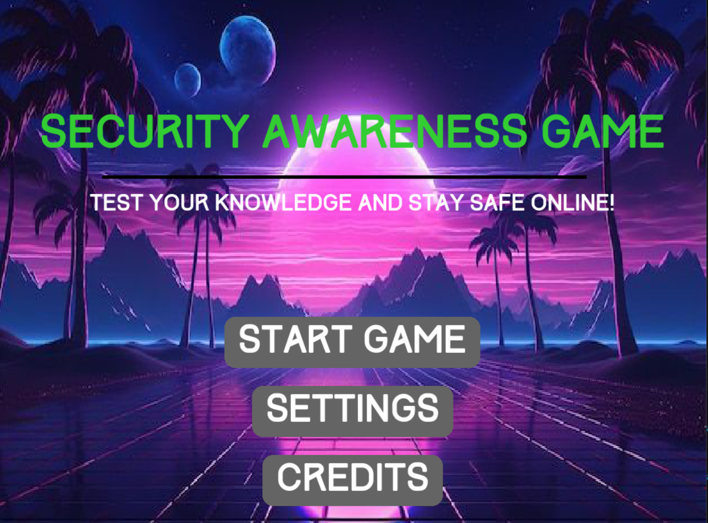

# Security Awareness Game

Welcome to the Security Awareness Game! This game is designed to test and enhance your knowledge of online security practices. Your goal is to answer security-related questions correctly to protect yourself and reduce the hacker's health. Stay vigilant and see how long you can survive!

## Table of Contents
- [Game Features](#game-features)
- [Installation](#installation)
- [How to Play](#how-to-play)
- [Screenshots](#screenshots)
- [Gameplay](#gameplay)

## Game Features
- **Interactive Gameplay**: Engage in a series of questions about cybersecurity, with consequences for incorrect answers.
- **Dynamic Graphics**: Enjoy a visually appealing interface with animated characters representing you and the hacker.
- **Sound Effects**: Experience immersive sound effects that react to your performance.
- **Music Toggle**: Control background music directly from the settings menu.
- **Educational Content**: Learn important security practices as you play.

## Installation

1. **Clone the Repository**:
    ```bash
    git clone https://github.com/workwithnaveen7/security-awareness-game.git
    cd security-awareness-game
    ```

2. **Install the Required Dependencies**:
    - Ensure you have Python installed on your system.
    - Install the Pygame library:
      ```bash
      pip install pygame
      ```

3. **Run the Game**:
    ```bash
    python game.py
    ```

## How to Play

- **Objective**: Answer security-related questions correctly to reduce the hacker's health while keeping your own health intact.
- **Questions**: Each question comes with multiple choices. Select the correct answer to damage the hacker; an incorrect answer will reduce your health.
- **Music Control**: Access the settings menu to toggle the background music on or off.
- **Credits**: Check the credits to visit the developer's website, LinkedIn, or GitHub. (myself)

### Controls
- **Mouse**: Click on the options to answer questions, toggle music, and navigate menus.

## Screenshots


## Gameplay

https://github.com/user-attachments/assets/7f484fdf-16f3-405a-9fac-8941e1909d02


